# C4 Model - Level 1: System Context Diagram

This diagram shows the FrankCrum CRM API system and its relationships with external users and systems.

```mermaid
graph TB
    User[👤 End Users<br/>Business Users, Administrators]
    ExternalApp[📱 External Applications<br/>Third-party integrations]
    
    System[FrankCrum CRM API<br/>Provides CRM operations via REST API]
    
    ExternalAPI[External CRM API<br/>Backend CRM System]
    
    User -->|Uses| System
    ExternalApp -->|Integrates with| System
    System -->|Calls| ExternalAPI
    
    style System fill:#4A90E2,stroke:#2E5C8A,stroke-width:3px,color:#fff
    style User fill:#E8F4F8,stroke:#2E5C8A,stroke-width:2px
    style ExternalApp fill:#E8F4F8,stroke:#2E5C8A,stroke-width:2px
    style ExternalAPI fill:#F5A623,stroke:#D68910,stroke-width:2px
```

## Description

The **FrankCrum CRM API** is a REST API system that:
- Serves **End Users** (business users and administrators) who need to access CRM data and operations
- Provides integration capabilities for **External Applications** that need to interact with CRM functionality
- Communicates with an **External CRM API** (backend system) to retrieve and manage CRM data

## Key Relationships

- **End Users** → **FrankCrum CRM API**: Users make HTTP requests to access client data, payroll managers, and onboarding automation features
- **External Applications** → **FrankCrum CRM API**: Third-party systems integrate via REST API endpoints
- **FrankCrum CRM API** → **External CRM API**: The system acts as a facade/proxy, forwarding requests to the backend CRM system
