# C4 Model - Level 2: Container Diagram

This diagram shows the high-level technical building blocks (containers) that make up the FrankCrum CRM API system.

```mermaid
graph TB
    User[👤 End Users]
    ExternalApp[📱 External Applications]
    
    subgraph "FrankCrum CRM API System"
        WebApp[Web Application<br/>ASP.NET Core 8.0<br/>REST API, Swagger, Authentication]
        AppLayer[Application Layer<br/>CrmService<br/>Business Logic Orchestration]
        InfraLayer[Infrastructure Layer<br/>CrmApiClient<br/>HTTP Client Implementation]
    end
    
    ExternalAPI[External CRM API<br/>Backend CRM System]
    
    User -->|HTTPS/REST| WebApp
    ExternalApp -->|HTTPS/REST| WebApp
    WebApp -->|Uses| AppLayer
    AppLayer -->|Uses| InfraLayer
    InfraLayer -->|HTTPS/REST| ExternalAPI
    
    style WebApp fill:#4A90E2,stroke:#2E5C8A,stroke-width:3px,color:#fff
    style AppLayer fill:#7ED321,stroke:#5BA517,stroke-width:2px,color:#fff
    style InfraLayer fill:#F5A623,stroke:#D68910,stroke-width:2px,color:#fff
    style ExternalAPI fill:#BD10E0,stroke:#9012FE,stroke-width:2px,color:#fff
```

## Containers

### 1. Web Application (FrankCrumCrm.Api)
- **Technology**: ASP.NET Core 8.0
- **Responsibilities**:
  - Exposes REST API endpoints
  - Handles HTTP requests/responses
  - Provides Swagger/OpenAPI documentation
  - Implements Bearer token authentication
  - Routes requests to application services
- **Ports**: HTTP/HTTPS (typically 5000/5001)

### 2. Application Layer (FrankCrumCrm.Application)
- **Technology**: .NET 8.0 Class Library
- **Responsibilities**:
  - Contains business logic orchestration
  - Defines application interfaces (ICrmApiClient)
  - Manages DTOs (Data Transfer Objects)
  - Coordinates use cases
- **Dependencies**: Domain Layer

### 3. Infrastructure Layer (FrankCrumCrm.Infrastructure)
- **Technology**: .NET 8.0 Class Library
- **Responsibilities**:
  - Implements HTTP client for external API communication
  - Handles JSON serialization/deserialization
  - Manages external API authentication
  - Provides concrete implementations of application interfaces
- **Dependencies**: Application Layer, Domain Layer

### 4. External CRM API
- **Technology**: External System (Unknown)
- **Responsibilities**:
  - Provides backend CRM data and operations
  - Manages client data, payroll managers, onboarding automation
- **Protocol**: HTTPS/REST

## Data Flow

1. **Request Flow**: User/External App → Web App → Application Layer → Infrastructure Layer → External API
2. **Response Flow**: External API → Infrastructure Layer → Application Layer → Web App → User/External App

## Technology Decisions

- **ASP.NET Core**: Modern, cross-platform web framework
- **Clean Architecture**: Separation of concerns, testability, maintainability
- **Dependency Injection**: Loose coupling, testability
- **Bearer Token Authentication**: Secure API access
- **Swagger/OpenAPI**: API documentation and testing
