# C4 Model - Level 3: Component Diagram

This diagram shows the components within the Web Application container and how they interact.

```mermaid
graph TB
    subgraph "Web Application Container (FrankCrumCrm.Api)"
        ClientDataCtrl[ClientDataController<br/>Handles client data endpoints]
        PayrollMgrCtrl[PayrollManagerController<br/>Handles payroll manager endpoints]
        OnboardingCtrl[OnboardingAutomationController<br/>Handles onboarding automation endpoints]
        AuthMiddleware[Authentication Middleware<br/>Bearer token validation]
        SwaggerConfig[Swagger Configuration<br/>OpenAPI documentation]
        Program[Program.cs<br/>Dependency injection & configuration]
    end
    
    subgraph "Application Layer (FrankCrumCrm.Application)"
        CrmService[CrmService<br/>Business logic orchestration]
        ICrmApiClient[ICrmApiClient<br/>Interface definition]
        CreateOnboardingDTO[CreateOnboardingRequest<br/>DTO]
    end
    
    subgraph "Infrastructure Layer (FrankCrumCrm.Infrastructure)"
        CrmApiClient[CrmApiClient<br/>HTTP client implementation]
        HttpClient[HttpClient<br/>.NET HTTP client]
    end
    
    subgraph "Domain Layer (FrankCrumCrm.Domain)"
        ClientData[ClientData Entity]
        PayrollManager[PayrollManager Entity]
        PIScreenClientInfo[PIScreenClientInformation Entity]
        EmployerOnbTemplate[EmployerOnbTemplatesProcessed Entity]
    end
    
    ExternalAPI[External CRM API]
    
    ClientDataCtrl -->|Uses| CrmService
    PayrollMgrCtrl -->|Uses| CrmService
    OnboardingCtrl -->|Uses| CrmService
    Program -->|Configures| AuthMiddleware
    Program -->|Configures| SwaggerConfig
    Program -->|Registers| CrmService
    Program -->|Registers| CrmApiClient
    
    CrmService -->|Uses| ICrmApiClient
    CrmService -->|Uses| ClientData
    CrmService -->|Uses| PayrollManager
    CrmService -->|Uses| PIScreenClientInfo
    CrmService -->|Uses| EmployerOnbTemplate
    CrmService -->|Uses| CreateOnboardingDTO
    
    CrmApiClient -.->|Implements| ICrmApiClient
    CrmApiClient -->|Uses| HttpClient
    CrmApiClient -->|Uses| ClientData
    CrmApiClient -->|Uses| PayrollManager
    CrmApiClient -->|Uses| PIScreenClientInfo
    CrmApiClient -->|Uses| EmployerOnbTemplate
    
    CrmApiClient -->|HTTPS| ExternalAPI
    
    style ClientDataCtrl fill:#4A90E2,stroke:#2E5C8A,stroke-width:2px,color:#fff
    style PayrollMgrCtrl fill:#4A90E2,stroke:#2E5C8A,stroke-width:2px,color:#fff
    style OnboardingCtrl fill:#4A90E2,stroke:#2E5C8A,stroke-width:2px,color:#fff
    style CrmService fill:#7ED321,stroke:#5BA517,stroke-width:2px,color:#fff
    style CrmApiClient fill:#F5A623,stroke:#D68910,stroke-width:2px,color:#fff
    style ExternalAPI fill:#BD10E0,stroke:#9012FE,stroke-width:2px,color:#fff
```

## Components

### Web Application Layer (FrankCrumCrm.Api)

#### Controllers
- **ClientDataController**: Handles client data related endpoints
  - `GET /api/v1/ClientData/{id}` - Get client by ID
  - `GET /api/v1/ClientData/{clientNumber}/division/numbers` - Get division numbers
  - `POST /api/v1/ClientData/payrollprocessingstatusclients` - Get payroll processing status
  - `GET /api/v1/ClientData/pi-screen/{id}` - Get PI screen information

- **PayrollManagerController**: Handles payroll manager endpoints
  - `GET /api/v1/Users/PayrollManagers` - Get all payroll managers

- **OnboardingAutomationController**: Handles onboarding automation CRUD operations
  - `GET /api/v1/OnboardingAutomation` - Get all
  - `GET /api/v1/OnboardingAutomation/{id}` - Get by ID
  - `POST /api/v1/OnboardingAutomation` - Create
  - `PUT /api/v1/OnboardingAutomation/{id}` - Update
  - `DELETE /api/v1/OnboardingAutomation/{id}` - Delete

#### Infrastructure Components
- **Authentication Middleware**: Validates Bearer tokens
- **Swagger Configuration**: Provides OpenAPI documentation
- **Program.cs**: Configures dependency injection, middleware pipeline, and services

### Application Layer (FrankCrumCrm.Application)

- **CrmService**: Orchestrates business logic and delegates to infrastructure
- **ICrmApiClient**: Interface defining contract for external API communication
- **CreateOnboardingRequest**: DTO for creating onboarding automation

### Infrastructure Layer (FrankCrumCrm.Infrastructure)

- **CrmApiClient**: Implements ICrmApiClient, handles HTTP communication with external API
- **HttpClient**: .NET HTTP client for making REST API calls

### Domain Layer (FrankCrumCrm.Domain)

- **ClientData**: Domain entity representing client information
- **PayrollManager**: Domain entity representing payroll manager
- **PIScreenClientInformation**: Domain entity for PI screen client data
- **EmployerOnbTemplatesProcessed**: Domain entity for onboarding automation

## Component Interactions

1. **Request Handling**: Controllers receive HTTP requests, validate authentication, and call CrmService
2. **Business Logic**: CrmService orchestrates operations and uses ICrmApiClient interface
3. **External Communication**: CrmApiClient implements ICrmApiClient and makes HTTP calls to external API
4. **Data Transformation**: Domain entities are used throughout the layers for type-safe data representation

## Dependencies

- **API → Application**: Controllers depend on CrmService
- **Application → Infrastructure**: CrmService depends on ICrmApiClient interface (Dependency Inversion)
- **Infrastructure → Domain**: CrmApiClient uses domain entities for serialization
- **Application → Domain**: CrmService uses domain entities for business logic
