# C4 Model - Level 3: Component Diagram

This diagram shows the components within the Web Application container and how they interact.

```mermaid
graph TD
    subgraph API["API Layer (FrankCrumCrm.Api)"]
        ClientDataCtrl[ClientDataController]
        PayrollMgrCtrl[PayrollManagerController]
        OnboardingCtrl[OnboardingAutomationController]
        Program[Program.cs]
        AuthMiddleware[Auth Middleware]
        SwaggerConfig[Swagger Config]
    end
    
    subgraph App["Application Layer (FrankCrumCrm.Application)"]
        CrmService[CrmService]
        ICrmApiClient[ICrmApiClient]
        DTOs[DTOs]
    end
    
    subgraph Infra["Infrastructure Layer (FrankCrumCrm.Infrastructure)"]
        CrmApiClient[CrmApiClient]
        HttpClient[HttpClient]
    end
    
    subgraph Domain["Domain Layer (FrankCrumCrm.Domain)"]
        Entities[Domain Entities]
    end
    
    ExternalAPI[External CRM API]
    
    ClientDataCtrl --> CrmService
    PayrollMgrCtrl --> CrmService
    OnboardingCtrl --> CrmService
    Program --> AuthMiddleware
    Program --> SwaggerConfig
    Program --> CrmService
    Program --> CrmApiClient
    
    CrmService --> ICrmApiClient
    CrmService --> Entities
    CrmService --> DTOs
    
    CrmApiClient -.-> ICrmApiClient
    CrmApiClient --> HttpClient
    CrmApiClient --> Entities
    
    CrmApiClient -->|HTTPS| ExternalAPI
    
    style ClientDataCtrl fill:#4A90E2,stroke:#2E5C8A,stroke-width:2px,color:#fff
    style PayrollMgrCtrl fill:#4A90E2,stroke:#2E5C8A,stroke-width:2px,color:#fff
    style OnboardingCtrl fill:#4A90E2,stroke:#2E5C8A,stroke-width:2px,color:#fff
    style Program fill:#4A90E2,stroke:#2E5C8A,stroke-width:1px,color:#fff
    style AuthMiddleware fill:#4A90E2,stroke:#2E5C8A,stroke-width:1px,color:#fff
    style SwaggerConfig fill:#4A90E2,stroke:#2E5C8A,stroke-width:1px,color:#fff
    style CrmService fill:#7ED321,stroke:#5BA517,stroke-width:3px,color:#fff
    style ICrmApiClient fill:#7ED321,stroke:#5BA517,stroke-width:2px,color:#fff
    style DTOs fill:#7ED321,stroke:#5BA517,stroke-width:1px,color:#fff
    style CrmApiClient fill:#F5A623,stroke:#D68910,stroke-width:3px,color:#fff
    style HttpClient fill:#F5A623,stroke:#D68910,stroke-width:1px,color:#fff
    style Entities fill:#50E3C2,stroke:#2E8B73,stroke-width:2px,color:#000
    style ExternalAPI fill:#BD10E0,stroke:#9012FE,stroke-width:3px,color:#fff
```

## Components

### API Layer (FrankCrumCrm.Api)

#### Controllers
- **ClientDataController**: Handles 19+ client data endpoints including:
  - Client data retrieval (`GET /api/v1/ClientData/{id}`)
  - Division numbers (`GET /api/v1/ClientData/{clientNumber}/division/numbers`)
  - PI Screen operations (billing, payroll, contacts, notes)
  - Payroll processing status, offsets, processing teams
  - Client PIN updates, WOTC client checks

- **PayrollManagerController**: Handles payroll manager endpoints
  - `GET /api/v1/Users/PayrollManagers` - Get all payroll managers

- **OnboardingAutomationController**: Handles onboarding automation CRUD operations
  - `GET /api/v1/OnboardingAutomation` - Get all
  - `GET /api/v1/OnboardingAutomation/{id}` - Get by ID
  - `POST /api/v1/OnboardingAutomation` - Create
  - `PUT /api/v1/OnboardingAutomation/{id}` - Update
  - `DELETE /api/v1/OnboardingAutomation/{id}` - Delete

#### Infrastructure Components
- **Program.cs**: Configures dependency injection, middleware pipeline, and services
- **Authentication Middleware**: Validates Bearer tokens
- **Swagger Configuration**: Provides OpenAPI documentation

### Application Layer (FrankCrumCrm.Application)

- **CrmService**: Orchestrates business logic and delegates to infrastructure layer
- **ICrmApiClient**: Interface defining contract for external API communication (Dependency Inversion Principle)
- **DTOs**: Data Transfer Objects including:
  - `CreateOnboardingRequest` - For creating onboarding automation
  - `UpdateClientPinRequest` - For updating client PIN

### Infrastructure Layer (FrankCrumCrm.Infrastructure)

- **CrmApiClient**: Implements `ICrmApiClient`, handles HTTP communication with external API
- **HttpClient**: .NET HTTP client for making REST API calls

### Domain Layer (FrankCrumCrm.Domain)

- **Domain Entities**: Core business entities including:
  - `ClientData` - Client information
  - `PayrollManager` - Payroll manager data
  - `PIScreenClientInformation` - PI screen client data
  - `PIScreenBillingInformation` - Billing information
  - `PIScreenPayrollInformation` - Payroll information
  - `WCSurcharge` - Workers compensation surcharges
  - `EVerify` - E-Verify information
  - `TerminatedClientsInformation` - Terminated client data
  - `PIScreenClientContact` - Client contacts
  - `ContactTypeLookup` - Contact type lookup data
  - `PIScreenAdditionalContact` - Additional contact information
  - `Offsets` - Payment and shipping offsets
  - `ClientPayrollInformation` - Client payroll details
  - `ClientProcessingTeam` - Processing team information
  - `ProcessingTeamContacts` - Processing team contacts
  - `EmployerOnbTemplatesProcessed` - Onboarding automation data
  - And other domain entities

## Component Interactions

1. **Request Handling**: Controllers receive HTTP requests, validate authentication, and call CrmService
2. **Business Logic**: CrmService orchestrates operations and uses ICrmApiClient interface
3. **External Communication**: CrmApiClient implements ICrmApiClient and makes HTTP calls to external API
4. **Data Transformation**: Domain entities are used throughout the layers for type-safe data representation

## Dependencies

- **API → Application**: Controllers depend on CrmService
- **Application → Infrastructure**: CrmService depends on ICrmApiClient interface (Dependency Inversion)
- **Infrastructure → Domain**: CrmApiClient uses domain entities for serialization
- **Application → Domain**: CrmService uses domain entities for business logic
