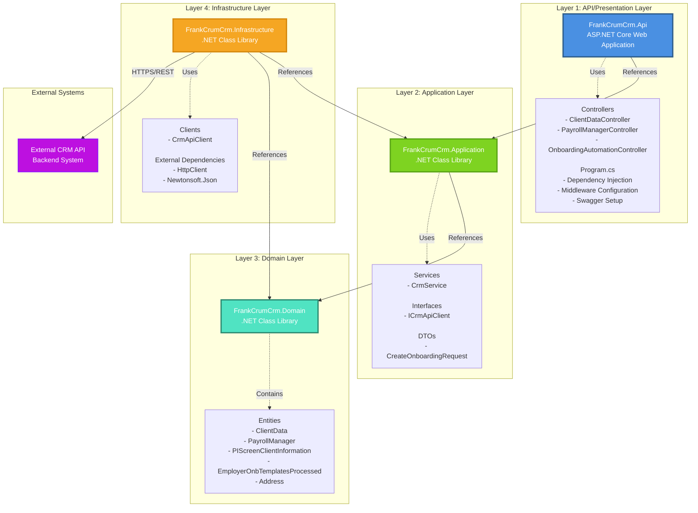

# Layered Architecture and Projects Diagram

This diagram illustrates the Clean Architecture layered structure and the projects that implement each layer.



## Architecture Layers

### Layer 1: API/Presentation Layer
**Project**: `FrankCrumCrm.Api`

**Purpose**: Entry point for the application, handles HTTP requests and responses.

**Responsibilities**:
- Expose REST API endpoints
- Handle HTTP request/response lifecycle
- Implement authentication and authorization
- Provide API documentation (Swagger)
- Configure dependency injection
- Set up middleware pipeline

**Key Components**:
- Controllers (ClientDataController, PayrollManagerController, OnboardingAutomationController)
- Program.cs (application configuration)
- appsettings.json (configuration)

**Dependencies**: References Application Layer only

---

### Layer 2: Application Layer
**Project**: `FrankCrumCrm.Application`

**Purpose**: Contains business logic and use case orchestration.

**Responsibilities**:
- Define application interfaces
- Implement business logic services
- Define DTOs (Data Transfer Objects)
- Orchestrate use cases
- Coordinate between domain and infrastructure

**Key Components**:
- CrmService (business logic orchestration)
- ICrmApiClient (interface for external API communication)
- CreateOnboardingRequest (DTO)

**Dependencies**: References Domain Layer only (follows Dependency Inversion Principle)

---

### Layer 3: Domain Layer
**Project**: `FrankCrumCrm.Domain`

**Purpose**: Core business entities and domain models.

**Responsibilities**:
- Define domain entities
- Represent core business concepts
- Provide type-safe data structures
- No dependencies on other layers

**Key Components**:
- ClientData
- PayrollManager
- PIScreenClientInformation
- EmployerOnbTemplatesProcessed
- Address

**Dependencies**: None (core layer)

---

### Layer 4: Infrastructure Layer
**Project**: `FrankCrumCrm.Infrastructure`

**Purpose**: External integrations and technical implementations.

**Responsibilities**:
- Implement application interfaces
- Handle external API communication
- Manage HTTP clients
- Handle JSON serialization/deserialization
- Provide concrete implementations

**Key Components**:
- CrmApiClient (implements ICrmApiClient)
- HTTP client configuration
- External API integration

**Dependencies**: References Application Layer (to implement interfaces) and Domain Layer (to use entities)

---

## Dependency Rules

1. **API Layer** → **Application Layer**: Controllers use application services
2. **Application Layer** → **Domain Layer**: Services use domain entities
3. **Infrastructure Layer** → **Application Layer**: Implements application interfaces
4. **Infrastructure Layer** → **Domain Layer**: Uses domain entities
5. **Domain Layer**: No dependencies (core layer)
6. **No circular dependencies**: Dependencies flow inward

## Solution Structure

```
FrankCrumCrm.sln
├── FrankCrumCrm.Api              # Layer 1: API/Presentation
│   ├── Controllers/
│   ├── Program.cs
│   └── appsettings.json
│
├── FrankCrumCrm.Application      # Layer 2: Application
│   ├── Services/
│   ├── Interfaces/
│   └── DTOs/
│
├── FrankCrumCrm.Domain           # Layer 3: Domain
│   └── Entities/
│
└── FrankCrumCrm.Infrastructure   # Layer 4: Infrastructure
    └── Clients/
```

## Benefits of This Architecture

1. **Separation of Concerns**: Each layer has a single, well-defined responsibility
2. **Testability**: Layers can be tested independently with mocks
3. **Maintainability**: Changes in one layer don't affect others
4. **Flexibility**: Easy to swap implementations (e.g., different external API clients)
5. **Dependency Inversion**: Application layer defines interfaces, infrastructure implements them
6. **Domain Independence**: Domain layer is independent of external concerns
